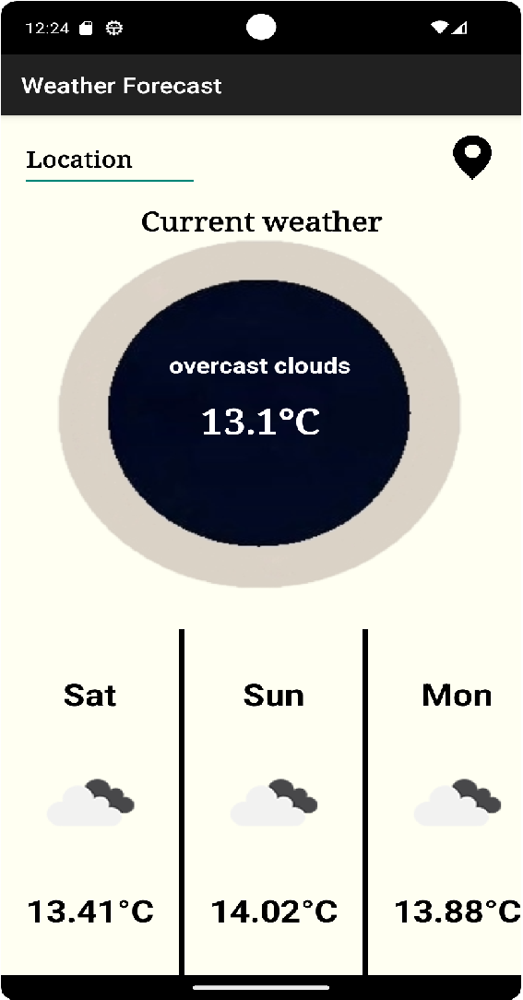

# Weather Forecast App



This Android app provides current weather information and a 5-day weather forecast for a given location. It uses the OpenWeatherMap API to fetch weather data.

## Features

- Display current weather conditions including temperature and description.
- Get a 5-day weather forecast with day names, weather icons, and temperatures.
- Search for weather data by location name.
- Use the device's GPS to get weather data based on the current location.

## Installation

1. Clone this repository to your local machine.
2. Open the project in Android Studio.
3. Build and run the app on an Android emulator or physical device.

## Usage

- Enter a location in the search bar and press Enter or click the search button to get weather data for that location.
- Allow the app to access your device's location to get weather data based on your current location.

## API Key

This app uses the OpenWeatherMap API to fetch weather data. You need to obtain an API key from [OpenWeatherMap](https://openweathermap.org/api) and replace it in the `WeatherService` class.

```kotlin
private val apiKey = "your_api_key_here"
